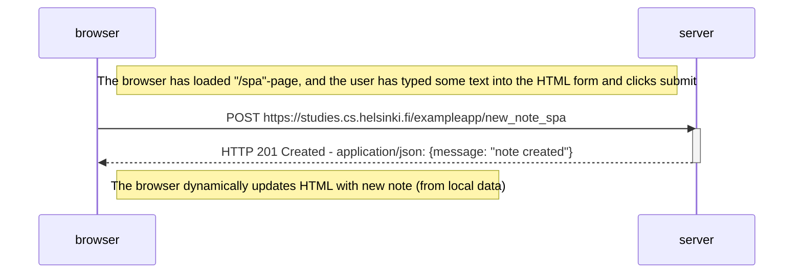

```mermaid
sequenceDiagram
    participant browser
    participant server

    Note right of browser: The browser has loaded "/spa"-page, and the user has typed some text into the HTML form and clicks submit

    browser->>server: POST https://studies.cs.helsinki.fi/exampleapp/new_note_spa
    activate server
    server-->>browser: HTTP 201 Created - application/json: {message: "note created"}
    deactivate server

    Note right of browser: The browser dynamically updates HTML with new note (from local data)
```